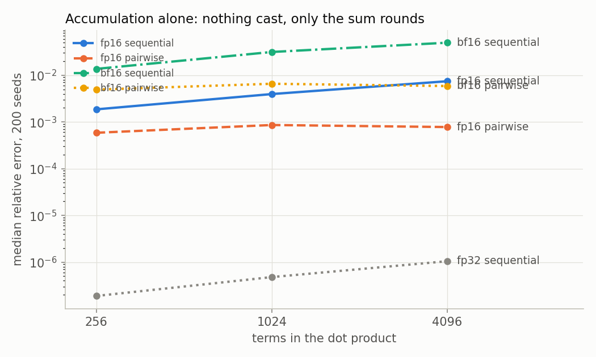
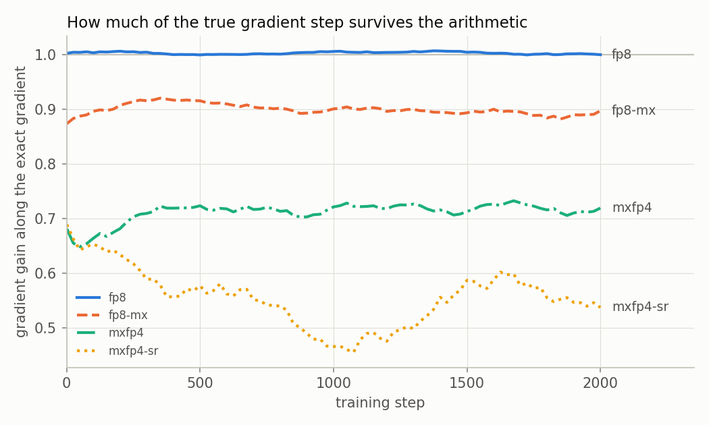
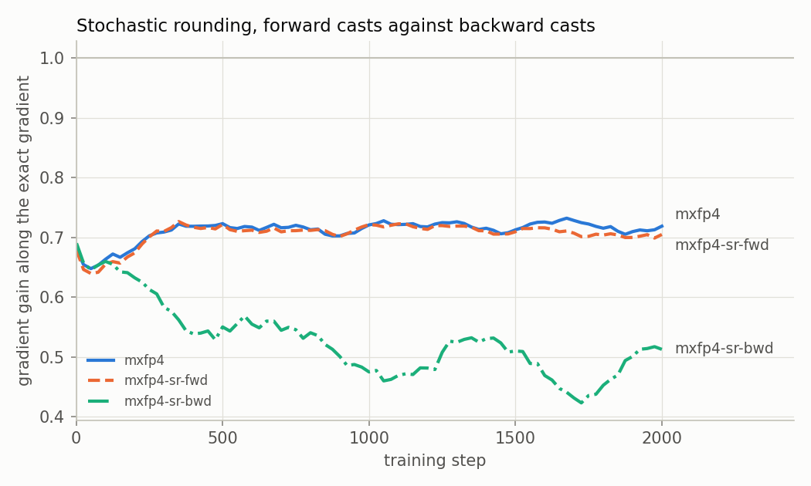
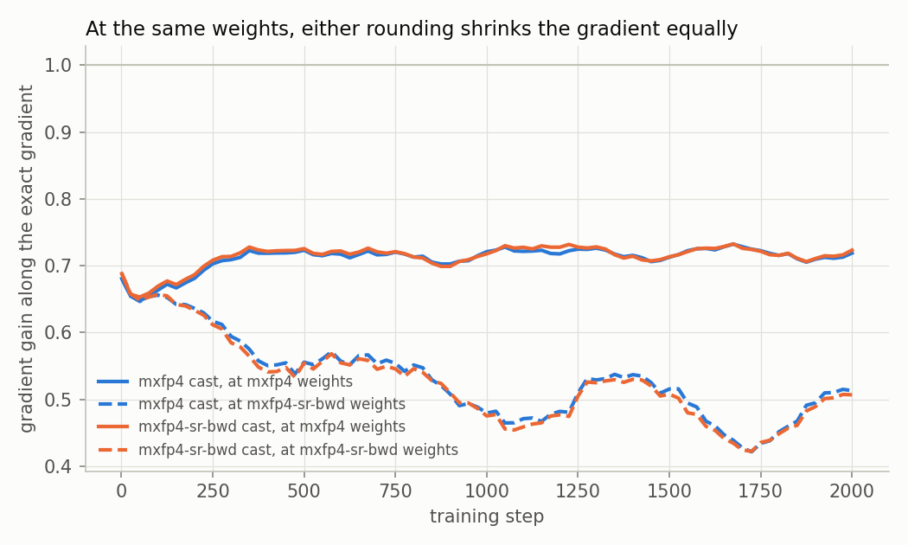

# drift

[](https://github.com/aarohigandhi/drift/actions/workflows/ci.yml)

Bit-exact arithmetic attribution for low-precision training.

When a low-precision training run goes wrong, the cause gets named from a short
list: not enough exponent bits, a stale scaling factor, the wrong rounding mode.
It almost never gets measured, because on real hardware it can't be. You can't
keep the format fixed and change only the order a kernel adds its products in.
The order is part of the kernel.

In software you can. This repo re-implements the arithmetic of a matmul bit for
bit and makes every decision a separate setting: input format, gradient format,
rounding, scaling, accumulator width and summation order. Then it trains a model
on real text under each setting, and at every measurement step it recomputes the
gradient exactly, so a difference between runs can be traced to the one setting that changed.

## Results

### Summation order matters only when the accumulator is narrow

Nothing is cast here. The products are exact and the sum is the only thing that
rounds. Median relative error over 200 seeds:



| accumulator | sequential | pairwise | blocked, k=32 |
|---|---:|---:|---:|
| fp32 | 1.05e-06 | 1.06e-07 | 1.98e-07 |
| fp16 | 7.43e-03 | 7.77e-04 | 6.94e-04 |
| bf16 | 4.96e-02 | 5.87e-03 | 6.87e-03 |

In fp32 the order changes the error, but only between a ten-millionth and a
millionth, far below any cast.
In a 16-bit accumulator, sequential summation is about 10× worse than pairwise.
It also keeps growing with length, while pairwise and blocked stay flat.

A sequential bf16 accumulator at 4,096 terms loses **4.96e-02**. Casting the
inputs to FP8 E4M3 with per-tensor scaling loses **3.61e-02**. At that length, a
16-bit sum costs more than an 8-bit cast.

Those vectors are synthetic, a normal draw times a lognormal scale.
`RealDotSweep` runs the same comparison on real tensors: the first layer of the
wide model described below, 64 held-out windows of 2,048-wide input against each
of its 64 weight rows, for 4,096 real pre-activations. Median relative error, at
initialization and after 1,000 steps of fp32 training:

| policy | init | trained |
|---|---:|---:|
| fp32 accumulator, sequential | 6.80e-07 | 4.70e-07 |
| fp16 accumulator, sequential | 5.51e-03 | 3.87e-03 |
| fp16 accumulator, pairwise | 7.72e-04 | 4.58e-04 |
| bf16 accumulator, sequential | **4.27e-02** | **2.98e-02** |
| bf16 accumulator, pairwise | 5.87e-03 | 3.65e-03 |
| e4m3 per-tensor cast | **3.81e-02** | **1.27e-02** |
| bf16 cast | 2.42e-03 | 7.36e-04 |

The real tensors keep the same order, and training sharpens it. The trained
tensors fit a per-tensor scale better, so the E4M3 cast loses a third of what it
did at init, while a sequential bf16 sum barely improves. After training, summing
sequentially in bf16 costs 2.3× more than casting to E4M3. The RMS error ratios in
[`results/real_dot_table.md`](results/real_dot_table.md) show the same.

### The OCP shared exponent helps FP4 and hurts FP8

MX formats scale each block of 32 values by `2^(floor(log2(amax)) - emax)`. That
puts the block maximum in `[2^emax, 2^(emax+1))`, but no element format reaches
the top of that range. E4M3 stops at 448 out of [256, 512), and E2M1 stops at 6
out of [4, 8). So any value whose scaled magnitude lands above that limit gets
clamped. Adding one to the exponent ("+1" below) means nothing clamps, at the
cost of one bit of resolution.

| element format | per-tensor | MX, spec | MX, +1 | clamped per pair, spec |
|---|---:|---:|---:|---:|
| e4m3 | **3.61e-02** | 4.80e-02 | 3.82e-02 | 57.3 |
| e2m1 | 4.08e-01 | **1.97e-01** | 2.92e-01 | 143.2 |

With 8-bit elements the extra bit costs almost nothing, so clamping is pure loss.
With 4-bit elements resolution is scarce, and on a single dot product clamping is
the cheaper error. Training splits the same way, FP8 helped by headroom and FP4
diverging with it, but the probes below show the FP4 half is not about per-step
error.

### Training

A character-level language model trained on the Python language reference
(498k characters). Every run with the same seed starts from the same weights and
sees the same batches, so runs differ only in their arithmetic. Held-out loss is
always computed exactly, so it measures the weights a run produced, not its
arithmetic at eval time. 2,000 steps, 3 seeds each.

Every 25 steps the gradient is also computed exactly, from the same weights and
batch. **cos** is its angle to the run's gradient. **gain** is the run's
gradient projected onto the exact one: 1 is unbiased, and below 1 the arithmetic
is shrinking the step.

| policy | diverged | held-out loss, mean (range) | vs fp32, paired | grad cos | grad gain | grad rel. error |
|---|---:|---|---:|---:|---:|---:|
| `exact` | 0/3 | 1.942 (1.941–1.943) | +0.000 | 1.0000 | 1.000 | 0.000 |
| `fp32` | 0/3 | 1.942 (1.941–1.943) | +0.000 | 1.0000 | 1.000 | 0.000 |
| `bf16` | 0/3 | 1.942 (1.941–1.943) | +0.000 | 1.0000 | 1.000 | 0.004 |
| `fp8` | 0/3 | 1.945 (1.943–1.948) | +0.003 | 0.9961 | 1.003 | 0.089 |
| `fp8-delayed` | 0/3 | 1.942 (1.941–1.945) | +0.000 | 0.9960 | 1.003 | 0.090 |
| `fp8-e4m3-grads` | 0/3 | 1.945 (1.938–1.951) | +0.003 | 0.9974 | 1.001 | 0.072 |
| `fp8-mx` | 0/3 | 1.960 (1.941–1.985) | +0.018 | 0.9884 | 0.900 | 0.170 |
| `fp8-mx-headroom` | 0/3 | 1.941 (1.936–1.948) | -0.001 | 0.9975 | 1.001 | 0.071 |
| `fp8-reversed` | 0/3 | 1.944 (1.938–1.947) | +0.002 | 0.9960 | 1.002 | 0.090 |
| `fp8-acc-fp16` | 0/3 | 1.945 (1.943–1.946) | +0.003 | 0.9960 | 1.003 | 0.090 |
| `fp8-acc-fp16-pairwise` | 0/3 | 1.940 (1.934–1.945) | -0.002 | 0.9960 | 1.003 | 0.090 |
| `fp8-acc-bf16` | 0/3 | 1.941 (1.936–1.945) | -0.001 | 0.9957 | 1.003 | 0.093 |
| `fp8-acc-bf16-pairwise` | 0/3 | 1.946 (1.939–1.950) | +0.004 | 0.9960 | 1.003 | 0.090 |
| `fp8-acc-bf16-blocked` | 0/3 | 1.938 (1.937–1.939) | -0.004 | 0.9959 | 1.003 | 0.091 |
| `fp8-acc-bf16-sr` | 0/3 | 1.944 (1.938–1.952) | +0.002 | 0.9955 | 1.003 | 0.096 |
| `mxfp4` | 0/3 | 2.044 (2.024–2.070) | +0.102 | 0.9125 | 0.714 | 0.432 |
| `mxfp4-headroom` | 3/3 | — | — | 0.7655 | 0.807 | 0.687 |
| `mxfp4-sr` | 0/3 | 2.393 (2.325–2.430) | +0.451 | 0.7718 | 0.548 | 0.640 |



What the runs say, largest effect first:

- **FP4 with MX headroom diverges every time**, at steps 797, 1,141 and 1,442.
  It clamps nothing. The same format with the spec's exponent clamps about 38% of
  activations and still trains, 0.10 above fp32. It is not that the headroom cast
  gives a worse gradient: probed at the same weights, it is unbiased and about as
  accurate as the spec cast. It fails through where it takes training. See the
  probes below.
- **FP8 with the MX spec exponent shrinks every gradient by 10%** (gain 0.900), and
  its held-out loss is the worst of the FP8 runs. The cause is measured: 27–30% of
  activations clamp. tanh outputs sit just below 1.0, so a block maximum like
  0.99 is scaled into the top of [256, 512), and everything above 448/512 = 0.875
  clamps to 0.875. One bit of headroom brings the gain to 1.001 and the loss back
  to fp32's. The shrinkage grows with depth, 0.96 at the first layer and 0.86 at
  the last.
- **Stochastic rounding of the FP4 cast is the worst setting that still trains**:
  +0.45 held-out loss and gain 0.55. Splitting it in two puts all of the damage in
  the backward pass. The split is below the list.
- **Every accumulator variant trains like `fp8`.** fp16 and bf16 accumulators,
  sequential, pairwise, blocked or stochastic, land between 1.938 and 1.946
  against `fp8`'s 1.945. The lowest, blocked bf16, is below even the exact run
  (1.942), so this spread is trajectory noise, not a difference in arithmetic
  quality. This model's widest matmul is 128 terms, where the dot sweep puts
  accumulator error far below the FP8 cast. The wide model below is where order
  shows up.
- **Delayed scaling, E4M3 gradients and reversed order changed nothing measurable
  here.** Delayed scaling fails when a tensor's range grows faster than its amax
  history, and this small, stable model never does that.
- **bf16 matches fp32 and exact** to three decimals.

### Summation order in a wide model

The main model's widest matmul is 128 terms, too short for the accumulator to
matter. So this model is built for it: 32 characters of context and 64-wide
embeddings make the first layer's input 2,048 wide, with hidden size 64 (148k
parameters). Nothing is cast. Each run is `fp32` with only the accumulator
changed. 1,000 steps, 3 seeds.

| policy | diverged | held-out loss, mean (range) | vs fp32, paired | grad cos | grad gain | grad rel. error |
|---|---:|---|---:|---:|---:|---:|
| `fp32` | 0/3 | 2.447 (2.431–2.475) | +0.000 | 1.0000 | 1.000 | 0.000 |
| `acc-fp16` | 0/3 | 2.479 (2.452–2.498) | +0.032 | 0.9999 | 1.000 | 0.013 |
| `acc-fp16-pairwise` | 0/3 | 2.468 (2.453–2.497) | +0.021 | 1.0000 | 1.000 | 0.002 |
| `acc-bf16` | 0/3 | 2.468 (2.438–2.521) | +0.021 | 0.9946 | 0.995 | 0.100 |
| `acc-bf16-pairwise` | 0/3 | 2.447 (2.427–2.481) | +0.000 | 0.9999 | 1.000 | 0.015 |
| `acc-bf16-blocked` | 0/3 | 2.463 (2.430–2.497) | +0.016 | 0.9998 | 1.000 | 0.018 |

The order effect from the dot sweep carries straight into the gradient. A bf16
accumulator summing sequentially puts 10% error in the gradient; pairwise puts
1.5%. fp16 shows the same 6.5× split, 1.3% against 0.2%. Almost all of it enters
at the 2,048-wide layer, where the bf16 sequential error is 11.9%, against 3.3% at
the output layer. The gain stays at 1.000 in every run but bf16 sequential (0.995).
So accumulator error is mostly noise, not shrinkage.

The loss is less clear. 13 of the 15 paired comparisons with `fp32` come out
worse, so a 16-bit accumulator costs something at this width. But the size of the
cost doesn't follow the gradient error. fp16 pairwise has the smallest gradient
error of all, 0.2%, and is worse on every seed by about 0.02. bf16 pairwise, with
seven times that error, lands on `fp32`. Those 15 comparisons share one `fp32` run
per seed, so they are not independent, and the gaps are smaller than `fp32`'s own
spread across seeds (2.431–2.475). Three seeds can show that the gradient changes,
not how much the loss follows it.

### Where the stochastic rounding damage comes from

`mxfp4-sr` rounds both the forward casts (weights and activations) and the
backward casts (output gradients) stochastically. Two more runs each change just
one half:

| policy | diverged | held-out loss, mean (range) | vs fp32, paired | grad cos | grad gain | grad rel. error |
|---|---:|---|---:|---:|---:|---:|
| `mxfp4` | 0/3 | 2.044 (2.024–2.070) | +0.102 | 0.9125 | 0.714 | 0.432 |
| `mxfp4-sr` | 0/3 | 2.393 (2.325–2.430) | +0.451 | 0.7718 | 0.548 | 0.640 |
| `mxfp4-sr-fwd` | 0/3 | 2.044 (2.041–2.048) | +0.102 | 0.8870 | 0.708 | 0.472 |
| `mxfp4-sr-bwd` | 0/3 | 2.440 (2.353–2.557) | +0.498 | 0.8006 | 0.521 | 0.618 |

Forward-only SR lands exactly on plain `mxfp4`: +0.102 either way. Backward-only
SR is +0.498, which covers all of the combined run's loss.



It isn't that each stochastically rounded gradient is more biased. At step 1 every
run has the same weights, and all four start with the same gain, 0.68 to 0.69.
They stay together through step 50. After that the backward-SR runs drift apart:
by step 1,000 their gain is 0.48, against 0.74 for `mxfp4`. So rounding gradients
stochastically steers training toward weights where FP4 shrinks the gradient
more.

Probes confirm it. A probe computes the gradient under a second policy at the
run's own weights and batch, without touching the update. (With probes on, the
runs reproduce the sweep's losses exactly.) Along each trajectory, both casts were
probed:

| weights from | cast probed | step 1 | steps 25–250 | steps 275–1000 | steps 1025–2000 |
|---|---|---:|---:|---:|---:|
| `mxfp4` | `mxfp4` | 0.681 | 0.689 | 0.717 | 0.719 |
| `mxfp4` | `mxfp4-sr-bwd` | 0.688 | 0.694 | 0.718 | 0.721 |
| `mxfp4-sr-bwd` | `mxfp4` | 0.681 | 0.619 | 0.534 | 0.490 |
| `mxfp4-sr-bwd` | `mxfp4-sr-bwd` | 0.688 | 0.615 | 0.528 | 0.485 |



At any given weights, nearest and stochastic rounding shrink the gradient by the
same amount, to within 0.006. What changes is the weights. Late in the
backward-SR runs, *either* cast keeps only 49% of the gradient, against 72% at
`mxfp4`'s weights. The backward-SR weights also clamp more: 52% of activations
over the run, against 37%.

That points at clamping, and a third probe confirms it. The cast with one bit of
MX headroom never clamps. Probed along both trajectories, at the same weights:

| weights from | no-clamp cast probed | step 1 | steps 25–250 | steps 275–1000 | steps 1025–2000 |
|---|---|---:|---:|---:|---:|
| `mxfp4` | `mxfp4-headroom` | 0.972 | 0.985 | 0.981 | 0.960 |
| `mxfp4-sr-bwd` | `mxfp4-headroom` | 0.972 | 1.022 | 0.991 | 0.813 |

Without the clamp, the gradient keeps 96–99% of its length at `mxfp4`'s weights,
where the spec cast keeps 72%. At the backward-SR weights it keeps 99% through
step 1,000, against 53%. After that it drops to 81%, still well above 49%, so
clamping is most of the shrinkage but not all of it by the end. The headroom
cast's total error at those weights is about the same as the spec cast's, 0.33 to
0.49 against 0.38 to 0.45 at `mxfp4`'s weights.

So both FP4 results turn out the same way. The spec cast shrinks gradients through
clamping, and backward SR makes that worse by moving to weights that clamp more.
The headroom cast gives an unbiased, equally accurate gradient wherever it is
probed, and training with it diverges anyway. At 4 bits, how good a gradient is at
one point doesn't predict what a cast does to training.

## How it works

```
java/   io.drift.fmt      minifloat formats, one parameterised implementation
        io.drift.kernel   NumericPolicy, casts and scaling, the dot product
        io.drift.train    the model, a policy-routed forward and backward, the sweep
        io.drift.tools    oracle table dump, dot-product sweeps (synthetic and real tensors)
python/ drift/minifloat   exact rational reference for every format
        verify_oracle.py  cross-checks Java against it
        analyze.py        tables and figures
```

The products in a dot product are exact, as they are in hardware: a tensor core
multiplies two narrow inputs into a wide intermediate and rounds nothing. The only
rounding is in the accumulator, which is the part real hardware won't let you
vary. `Dot` runs it in real fp32 (a Java `float`), or rounds after every add to
fp16 or bf16, in sequential, reversed, pairwise or blocked order.

MX scales are powers of two, so a block-scaled tensor can be stored dequantised
without changing a single product. Per-tensor scales are arbitrary floats, so
applying one is itself a rounding, and that rounding is part of the measurement.

Only the three linear layers run under a policy. Embeddings, biases, tanh,
softmax and the loss stay in double, which is the usual scope of an FP8 recipe.
Master weights and Adam state are stored as fp32.

A run can carry probes: other policies whose gradient is computed at every
measurement, from the run's weights and batch, and logged next to the run's own.
They never touch the update. That's what separates "this arithmetic is biased"
from "this arithmetic led training somewhere else", which comparing two runs
can't do. A test checks that a run with probes is identical to one without.

## What's checked

The formats are written twice, with no shared code. Java rounds by rescaling a
double by a power of two. Python works in `fractions.Fraction`, with no floating
point anywhere. `verify_oracle.py` compares every code, and every ordered pair of
codes as both a product and a sum:

| format | codes | pairs | result |
|---|---:|---:|---|
| e4m3 | 256 | 65,536 (all) | agree |
| e5m2 | 256 | 65,536 (all) | agree |
| e2m1 | 16 | 256 (all) | agree |
| e3m2, e2m3 | 64 | 4,096 (all) | agree |
| fp16, bf16 | 65,536 | 200,000 sampled | agree |

On its first run it found 154 disagreements in e4m3, all negative zero. A positive
zero times a negative number is negative zero, and a `Fraction` has no sign on
zero. Java was right; the reference now tracks signed zero.

The 24 JUnit tests hold the fast accumulator rounding bit-identical to the
verified formats over a million values per mode, random draws included. They also
check the exact model gradients against finite differences on every parameter.
The probe results depend on three more: a run with probes matches a run without
them exactly, a deterministic policy probing itself reproduces the run's own gain
to every digit, and saved weights reload bit-identical.

## Running it

Java 21 and Python 3.12+ with matplotlib.

```bash
cd java && ./gradlew test
./gradlew dumpTables --args="../results/oracle"
cd ../python && python verify_oracle.py --tables ../results/oracle
```

```bash
python prepare_corpus.py
cd ../java && ./gradlew dotSweep --args="../results/dot_sweep.csv"
./gradlew train --args="--seeds 1,2,3 --steps 2000"
./gradlew train --args="--policies mxfp4-sr-fwd,mxfp4-sr-bwd --seeds 1,2,3 --steps 2000 --summary summary-sr-split.csv"
./gradlew train --args="--out ../results/runs-wide --ctx 32 --emb 64 --hidden 64 --steps 1000 --seeds 1,2,3 --policies fp32,acc-fp16,acc-fp16-pairwise,acc-bf16,acc-bf16-pairwise,acc-bf16-blocked"
./gradlew train --args="--policies mxfp4,mxfp4-sr-bwd --probes mxfp4,mxfp4-sr-bwd --seeds 1,2,3 --steps 2000 --out ../results/runs-probe"
./gradlew train --args="--out ../results/runs-real --policies fp32 --seeds 1 --steps 1000 --ctx 32 --emb 64 --hidden 64 --save-weights true"
./gradlew realDotSweep --args="--init 1 --stage init"
./gradlew realDotSweep --args="--weights ../results/runs-real/fp32-s1.weights --stage trained"
cd ../python && python analyze.py
```

The corpus is taken from `pydoc_data/topics.py`, which ships with every Python
install, so there's nothing to download. Its text depends on the Python version.
These results used 3.14.0.

## Limitations

- **Small models.** The main model has 47k parameters and 128-term matmuls. The
  wide model reaches 2,048 terms, which is enough to show the order effect in the
  gradient, but not enough seeds or steps to say how much the loss follows it.
  Transformer widths and training lengths are beyond a CPU sweep.
- **An MLP, not a transformer.** Attention adds numerics of its own: softmax over
  long sequences, and products of two activations rather than activation times
  weight. None of that is measured.
- **tanh.** The MX clamping in training is so strong partly because tanh outputs
  crowd just below 1.0, the worst place for a shared exponent. Other activations
  crowd less. Softmax probabilities and sigmoid gates also sit just below 1, but
  that isn't measured here.
- **Three seeds.** Enough to separate the large effects from noise. Not enough to
  resolve differences of a few thousandths in held-out loss, and the table
  doesn't claim to.
